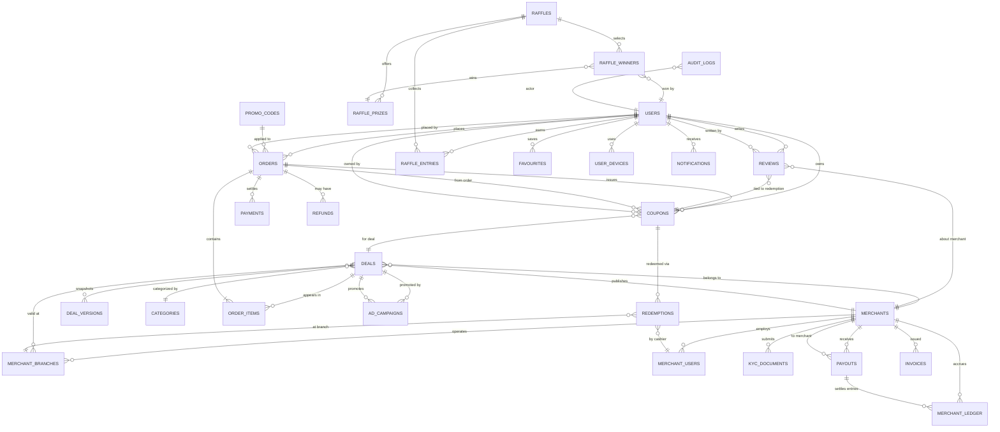
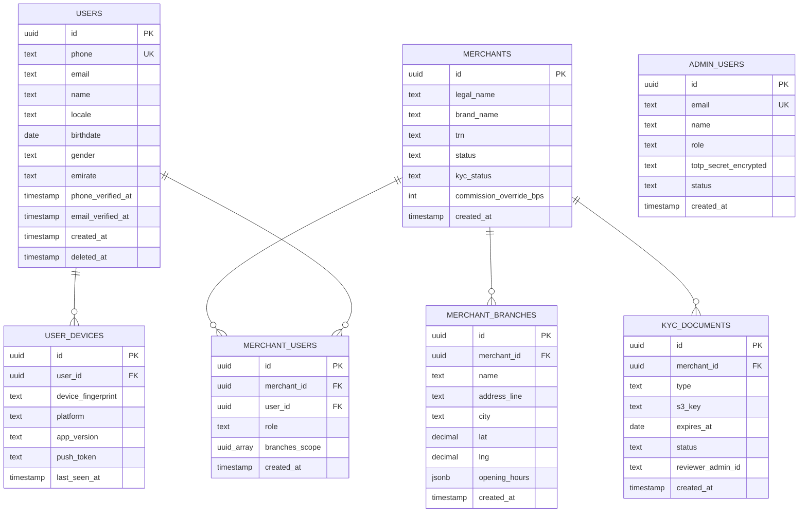
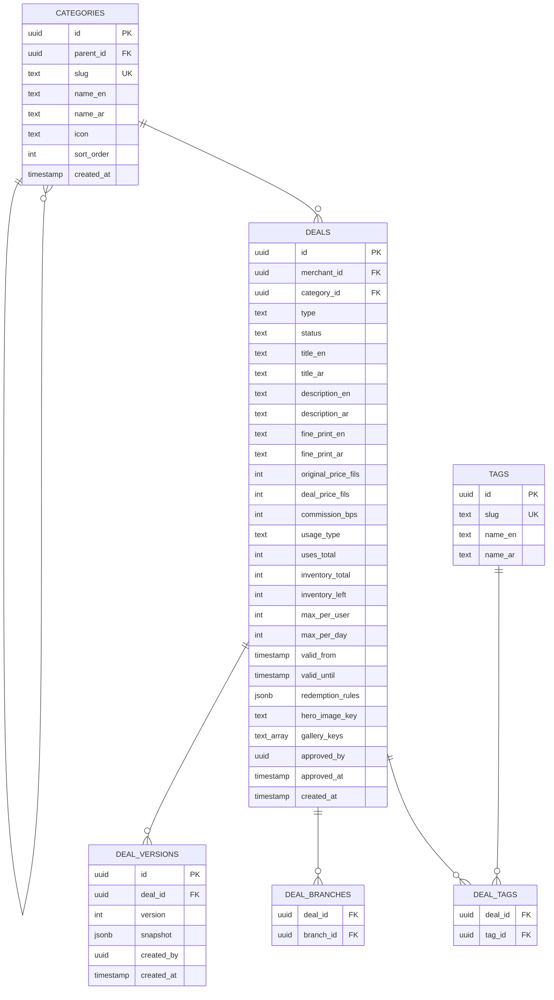
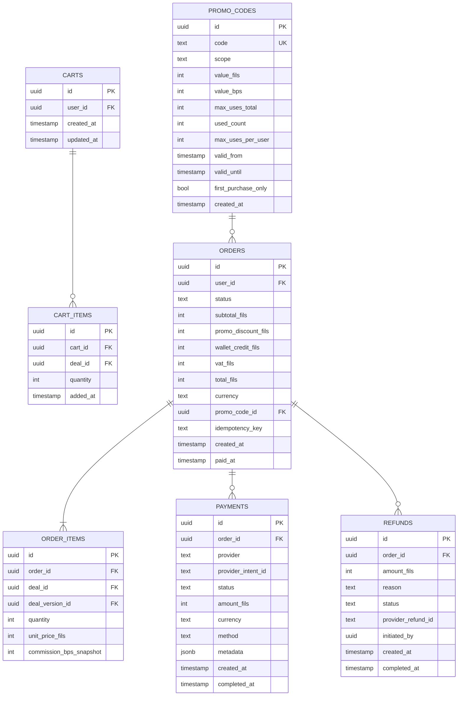
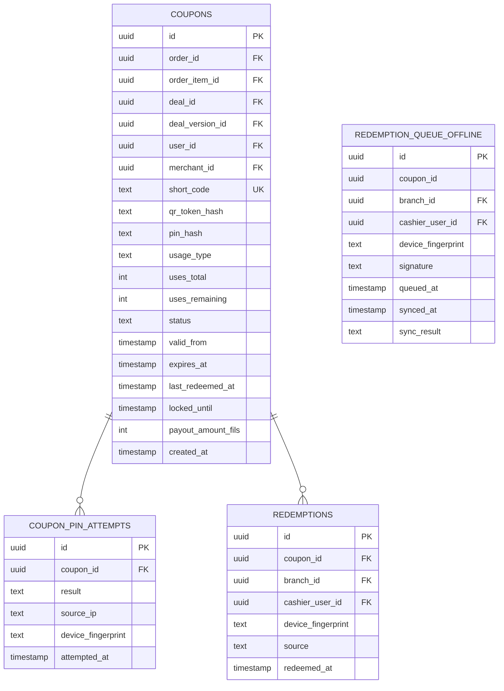
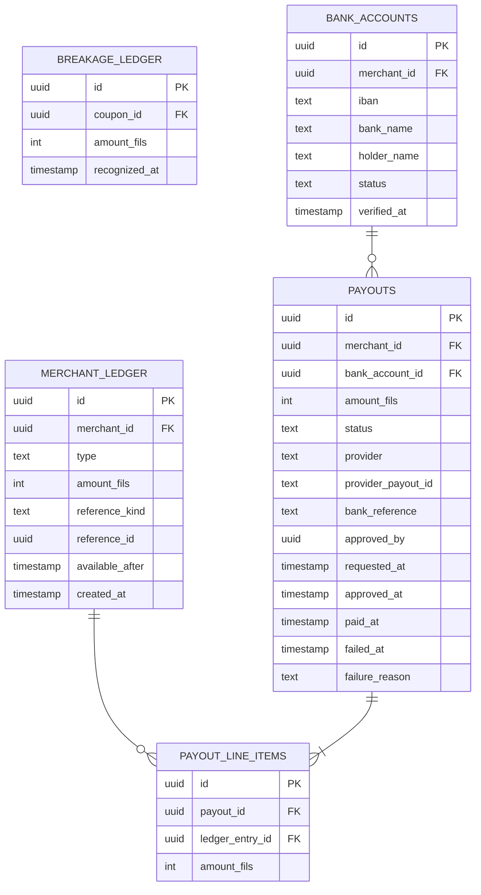
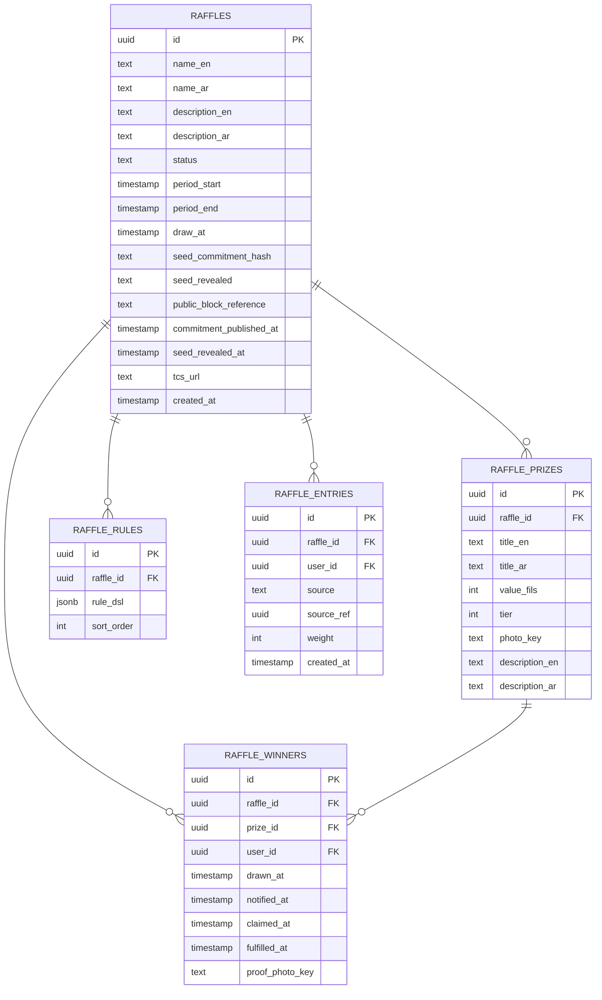
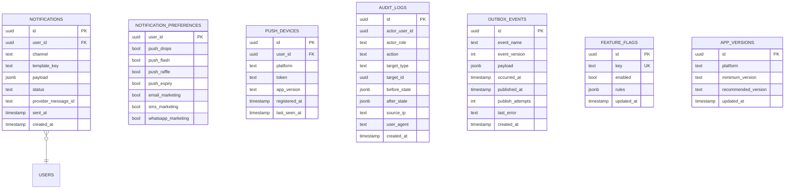

# 01 · ERD Overview

**Status:** 🟢 Approved

The Volu data model. This document gives the high-level entity relationships; the detailed schema with every column lives in [02-entities-detail.md](./02-entities-detail.md).

---

## Naming convention

- Tables use `snake_case`. Module ownership prefix: `<module>__<table>`. E.g. `identity__users`, `catalog__deals`, `commerce__orders`.
- Primary keys are `id UUID` (UUID v7 for sortability + uniqueness).
- Foreign keys are `<entity>_id` referencing the related table's `id`.
- Timestamps: `created_at`, `updated_at`, soft delete `deleted_at` (nullable).
- Soft delete via `deleted_at`; hard delete only by retention job.
- Money columns: `INTEGER` storing fils (1 AED = 100 fils). No floating-point money. Ever.
- Enums: PostgreSQL native enums for stability; lookup tables only when admin needs to manage them.
- Indexes: every FK indexed; every `WHERE`-filter column indexed.

---

## Top-level entity map

---

## Module ownership

Each table belongs to exactly one module:

| Module | Tables |
|---|---|
| **Identity** | `users`, `user_devices`, `merchants`, `merchant_branches`, `merchant_users`, `kyc_documents`, `admin_users`, `sessions` |
| **Catalog** | `categories`, `deals`, `deal_versions`, `deal_branches`, `deal_tags`, `tags` |
| **Commerce** | `orders`, `order_items`, `carts`, `cart_items`, `promo_codes`, `promo_code_usages` |
| **Payments** | `payments`, `payment_methods`, `payment_intents`, `inbound_webhooks` |
| **Coupons** | `coupons`, `coupon_pin_attempts` |
| **Redemption** | `redemptions`, `redemption_queue_offline` |
| **Wallet** | `merchant_ledger`, `breakage_ledger` |
| **Payouts** | `payouts`, `payout_line_items`, `bank_accounts` |
| **Refunds** | `refunds` |
| **Raffles** | `raffles`, `raffle_prizes`, `raffle_rules`, `raffle_entries`, `raffle_winners`, `raffle_seed_commitments` |
| **Loyalty** | `loyalty_balances`, `loyalty_transactions`, `referrals` |
| **Reviews** | `reviews`, `review_responses` |
| **Notifications** | `notifications`, `notification_preferences`, `notification_templates`, `push_devices` |
| **Ads** | `ad_campaigns`, `ad_campaign_metrics`, `ad_audience_templates` |
| **Invoicing** | `invoices`, `invoice_line_items` |
| **Favourites** | `favourites`, `merchant_follows` |
| **Audit** | `audit_logs` |
| **System** | `outbox_events`, `feature_flags`, `app_versions` |

Cross-module reads via the owning module's repository, not direct SQL.

---

## Identity sub-graph

---

## Catalog sub-graph

---

## Commerce + Payments sub-graph

---

## Coupons + Redemption sub-graph

---

## Wallet + Payouts sub-graph

---

## Raffles sub-graph

---

## Notifications + audit + system

---

## Sizing & growth assumptions

| Table | Rows after 12 months (target) | Strategy |
|---|---|---|
| `users` | ~150,000 | Single table; B-tree on `phone`, `email` |
| `merchants` | ~600 | Trivial |
| `deals` | ~5,000 active + ~30,000 historical | Partial index on `status='approved'` |
| `orders` | ~2,000,000 | Range-partitioned by `created_at` quarterly after 6 months |
| `coupons` | ~3,000,000 | Range-partitioned by `created_at` quarterly after 6 months |
| `redemptions` | ~2,000,000 | Range-partitioned by `redeemed_at` quarterly |
| `merchant_ledger` | ~6,000,000 | Range-partitioned by `created_at` quarterly |
| `raffle_entries` | ~10,000,000 | Range-partitioned by `raffle_id` |
| `audit_logs` | ~5,000,000 | Append-only; range-partitioned by `created_at` monthly; archived after 12 months |
| `notifications` | ~50,000,000 | Range-partitioned by `created_at` weekly; pruned after 90 days |

---

## Migration strategy

See [03-migrations-strategy.md](./03-migrations-strategy.md). All schema changes go through Prisma migrations; production migrations are expand-then-contract to allow zero-downtime deploys.

---

## See also

- [Detailed entity definitions](./02-entities-detail.md)
- [Migrations strategy](./03-migrations-strategy.md)
- [Backend Architecture](../03-architecture/03-backend-architecture.md)
